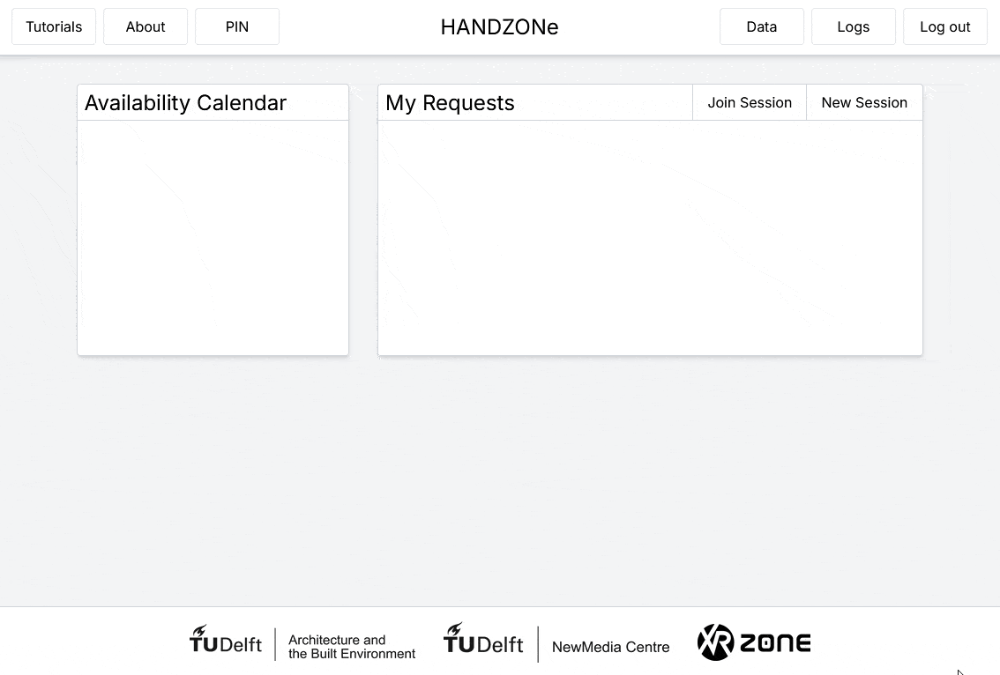
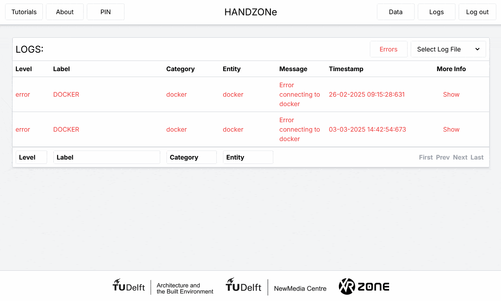

# HANDZONe Project<br/>

## Overview
**HANDZONe** project is a set of application that is designed to control and monitor robots for a **virtual reality** environment.

Currently, it's been developed to support the **Hybrid Learning Environment for Architectural Robotics** project.

It provides a user-friendly interface for managing and requesting robot sessions for both **simulated** and **real robots**, monitoring their status.

These sessions can be used to interact with robots in real-time inside a virtual reality application and/or by running programs inside Grasshopper with the Robots plugin and uploading these to the Virtual Reality sessions.

**[Applications](#applications)** • **[Features](#features)** • **[Prerequisites](#prerequisites)** • **[Getting Started](#getting-started)** • **[Contributing](#contributing)** • **[Contact](#contact)**


### Applications
- **[HANDZONe Server](server/README.md)**: The backend server for the HANDZONe project.
- **[HANDZONe Virtual Reality application](unity/README.md)**: The VR app for the HANDZONe project.
- **[HANDZONe Grasshopper plugin](grasshopper/README.md)**: The Grasshopper plugin for the HANDZONe project.

## Features

### VR Application  
- **Immersive Login System** - Secure authentication in virtual environment  
    
  
- **Multiplayer Collaboration** - Work together in shared virtual spaces
  
https://github.com/user-attachments/assets/0f91d174-672c-4f03-8a2c-706d82a56fa1
  
- **Physical Robot Control** - Operate real UR robots from within VR  

https://github.com/user-attachments/assets/e094eff1-8125-4c25-aae6-1baa6d5c1749
  
- **Interactive Tutorials** - Learn robot programming through guided lessons  

https://github.com/user-attachments/assets/39c3267a-9358-431a-9df5-e4744de90e9f

- **Virtual Robot Simulation** - Practice with virtualized robots before using physical hardware

https://github.com/user-attachments/assets/c3ff9a0e-e38f-41bb-8241-057fa040d8e5

### Web Interface  
- **Student Request System** - Request access to robot resources  
    
  
- **Teacher Dashboard** - Monitor student activity and robot usage  
    
  
- **Request Management** - Review and approve student access requests  
    
  
- **Real-time Monitoring** - Track robot status and operations  
    
  
### Additional Features  
- **Grasshopper Plugin** - Program robots using parametric design workflows  
- **Docker Containerization** - Deploy virtualized robots on demand  
- **Cross-Platform Compatibility** - Seamless experience across VR, desktop, and web  
- **Role-Based Access Control** - Customized interfaces for students, teachers, and administrators
  

## Prerequisites
Before you begin, ensure you have met the following requirements:
- **[Docker](https://www.docker.com/)**: For containerized deployment.
- **[Unity Editor (2022.3 or later)](https://unity.com/download)**: For running the VR application.
- **[Rhino 7 / Grasshopper](https://www.rhino3d.com/download/)**: For running the Grasshopper plugin.
- **[Robots Plugin](https://github.com/visose/Robots)**: For running robots programs inside Grasshopper.

## Getting Started

### 1. Clone the Repository
Clone the project repository to your local machine:
```bash
git clone https://github.com/newmedia-centre/handzone.git
```

### 2. Set Up HANDZONe Server
Follow the instructions in the [server/README](server/README.md) to set up the server.

### 3. Set Up HANDZONe Virtual Reality Application
Follow the instructions in the [handzone/README](unity/README.md) to set up the VR application.

### 4. Set Up HANDZONe Grasshopper Plugin
Follow the instructions in the [grasshopper/README](grasshopper/README.md) to set up the Grasshopper plugin.

### 5. Access the Application
- Once the containers are running, you can access the HANDZONe server at `http://localhost:3000`.
- Start the Unity VR application and connect to your IP of your machine running the server.
Load the Grasshopper plugin to run programs inside Grasshopper and upload meshes to the VR session.

## Contributing
We welcome contributions to the HANDZONe project! If you would like to contribute, please follow these steps:
1. Fork the repository.
2. Create a new branch for your feature or bug fix.
3. Make your changes and commit them.
4. Push your changes to your forked repository.
5. Submit a pull request.

## Contact
For any inquiries or feedback, please reach out to the project maintainers.
